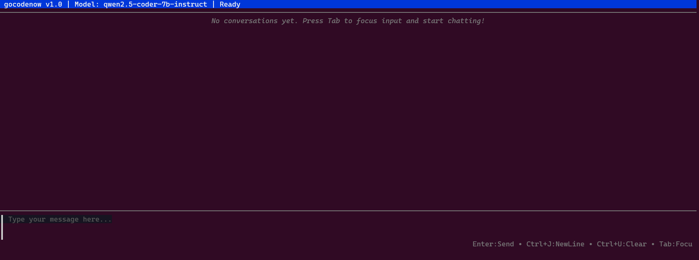

# UI Display Issue: Expanded Conversation View

## Screenshot Analysis: `1.png`

### Overview
Analysis of the expanded conversation view showing a completed "hi" → "Hello! How can I assist you today?" interaction.

---

## Observations

### ✅ **Working Correctly:**
1. **Conversation Expansion**: The conversation is properly expanded showing detailed view
2. **Status Display**: Shows "✅ completed" status correctly  
3. **Response Content**: LLM response "Hello! How can I assist you today?" is displaying properly
4. **UI Structure**: Clean layout with proper sections for request details and response

### 🔍 **Potential Issues/Areas for Improvement:**

#### 1. **Missing Performance Metrics**: 
- The "REQUEST DETAILS & PERFORMANCE" section shows:
  - Message: "hi" ✅
  - Status: "✅ completed" ✅ 
- But missing typical performance data like:
  - Duration/execution time
  - Token usage (input/output tokens)
  - Model information
  - Timestamp details

#### 2. **Empty Performance Section**: 
- There's a large empty space in the performance section
- Could be missing timing information, token counts, or other metrics

#### 3. **Minimal Metadata Display**:
- No timestamp shown for when the conversation occurred
- No token usage statistics visible
- No execution duration displayed

#### 4. **Response Section Layout**:
- The response shows correctly but could potentially have better formatting
- Simple text display without any syntax highlighting or formatting

#### 5. **Misalign border when conversation block expands** ✅ **FIXED**
```bash
╭────────────────────────────────────────────────────────────────────────────────────────────────────────────────────────────────────────────────────────────────────╮
│ ▼ User: hi [22:04] ✅                                                                                                                                              │
│                                                                                                                                                                    │
│    ╭────────────────────────────────────────────────────────────────────────────────────────────────────────────────────────────────────────────────────────────╮  │
│ │ ┌─ REQUEST DETAILS & PERFORMANCE                                                                                                                           │     │
│ │ Message: "hi"                                                                                                                                              │     │
│ │ Status: ✅ completed                                                                                                                                       │     │
│ │                                                                                                                                                            │     │
│ ╰────────────────────────────────────────────────────────────────────────────────────────────────────────────────────────────────────────────────────────────╯     │
│                                                                                                                                                                    │
│    ╭────────────────────────────────────────────────────────────────────────────────────────────────────────────────────────────────────────────────────────────╮  │
│ │ ┌─ RESPONSE                                                                                                                                                │     │
│ │ Hello! How can I assist you today?                                                                                                                         │     │
│ ╰────────────────────────────────────────────────────────────────────────────────────────────────────────────────────────────────────────────────────────────╯     │
╰────────────────────────────────────────────────────────────────────────────────────────────────────────────────────────────────────────────────────────────────────╯
```
Expected
```bash
╭────────────────────────────────────────────────────────────────────────────────────────────────────────────────────────────────────────────────────────────────────╮
│ ▼ User: hi [22:04] ✅                                                                                                                                              │
│                                                                                                                                                                    │
│ ╭────────────────────────────────────────────────────────────────────────────────────────────────────────────────────────────────────────────────────────────╮     │
│ │ ┌─ REQUEST DETAILS & PERFORMANCE                                                                                                                           │     │
│ │ Message: "hi"                                                                                                                                              │     │
│ │ Status: ✅ completed                                                                                                                                       │     │
│ │                                                                                                                                                            │     │
│ ╰────────────────────────────────────────────────────────────────────────────────────────────────────────────────────────────────────────────────────────────╯     │
│                                                                                                                                                                    │
│ ╭────────────────────────────────────────────────────────────────────────────────────────────────────────────────────────────────────────────────────────────╮     │
│ │ ┌─ RESPONSE                                                                                                                                                │     │
│ │ Hello! How can I assist you today?                                                                                                                         │     │
│ ╰────────────────────────────────────────────────────────────────────────────────────────────────────────────────────────────────────────────────────────────╯     │
╰────────────────────────────────────────────────────────────────────────────────────────────────────────────────────────────────────────────────────────────────────╯
```

---
#### 6. Hint is truncated. ✅ **FIXED**


- ✅ Maybe just show Enter: Send • Esc twice: Cancel • Help: F1
- ✅ F1 display  floating pane in the center to show all hot keys
  - Tab: Focus input
- ✅ Remove Input Tips, seems a nuisance to me. 

**Additional Fixes Applied:**
- ✅ Fixed footer text truncation by aligning left instead of right
- ✅ Removed Input Tips tooltip that appeared on startup  
- ✅ Help dialog now only closes with F1 (removed ? and Esc support)
- ✅ Help dialog is now scrollable with ↑↓/jk keys and Home for small terminal windows


## Most Likely Issue

The main concern appears to be **missing performance metrics and metadata** in the expanded view. When users expand a conversation, they typically expect to see detailed information like timing, token usage, model details, etc., but this expanded view seems to be missing that rich metadata.

---

## Expected vs Actual

### Expected Expanded View Should Include:
- ⏱️ **Execution Time**: How long the request took
- 🔢 **Token Usage**: Input tokens, output tokens, total
- 🤖 **Model Info**: Which model was used
- 📅 **Timestamp**: When the conversation occurred
- 🔧 **Technical Details**: Request/response metadata

### Currently Missing:
- All performance metrics appear to be empty or not displayed
- Large blank space where metrics should appear
- No technical metadata visible

---

## Priority Level
**Medium** - UI is functional but missing valuable user information for debugging and understanding system performance.